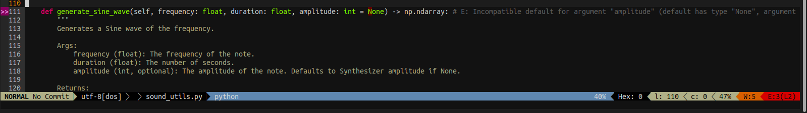

# Kirby VIMRC Configuration

## Overview

Welcome to the world of efficient text editing with Vim! This project offers a streamlined VIMRC configuration file, designed to enhance your Vim experience. If you're new to Vim, a VIMRC is a user-specific configuration file that holds custom settings and preferences for your Vim editor. By using this VIMRC, you can quickly optimize your Vim environment without delving into the complexities of manual configuration.

## What is a VIMRC?

A VIMRC (Vim Run Commands) is a plain text file that houses a collection of Vim settings, key mappings, plugins, and other customizations. It's your personal control center for tailoring Vim to your liking, making it an essential part of your Vim setup.

## Getting Started

Setting up your Vim environment with this simplified VIMRC is straightforward:

This Repository contains two important files:
- `.vimrc` - The VIMRC file.
- `init.vim` - The additional VIMRC file for Neovim.

As well as an installation script:
- `install.sh` - The installation script.

Either copy the `.vimrc` to your home directory (and the `init.vim` to `.config/nvim/init.vim` if you are using Neovim) or run the installation script, which does it for you.

```bash
# Plain Vim installation
$ ./install.sh

# Neovim installation
$ ./install.sh --neovim
```

It is recommended to use the installer as it will source the VIMRC for you.

That's it! Your Vim environment is now equipped with the enhanced settings and optimizations provided by the VIMRC file.
The script is designed to automatically perform some setup and install some plugins, all of this can be modified and all of the sections are labeled with comments.

Use `zo` to open a fold and `zc` to close it, when you are in normal mode.

## Features

The script will automatically install the following plugins:

- [vim-plug](http://www.github.com/junegunn/vim-plug) - A minimalist Vim plugin manager.
- [powerline](http://www.github.com/powerline/powerline) - A statusline plugin for Vim.
- [vim-airline](http://www.github.com/vim-airline/vim-airline) - A lightweight status/tabline for Vim.
- [vim-airline-themes](http://www.github.com/vim-airline/vim-airline-themes) - A collection of themes for vim-airline.
- [vim-fugitive](http://www.github.com/tpope/vim-fugitive) - A Git wrapper so awesome, it should be illegal.
- [ale](http://www.github.com/dense-analysis/ale) - Asynchronous Lint Engine.
- [nerdtree](http://www.github.com/preservim/nerdtree) - A tree explorer plugin for Vim.

As well as the following colorschemes:

- [Molokai](http://www.github.com/tomasr/molokai) - A port of the monokai theme for TextMate.

## Customization

Feel free to explore the VIMRC file you've downloaded. It's a plain text file, so you can modify it using any text editor. Within the VIMRC, you'll find comments that explain various sections. If you're comfortable with Vimscript, you can tailor the settings to match your preferences.

## Screenshots


An image of the VIMRC file.


An example of the output from ALE.

## Contributions

If you'd like to contribute to this project by suggesting improvements, fixing issues, or sharing your own customizations, you're welcome to do so. Simply fork this repository, make your changes, and submit a pull request.

## Feedback and Support

If you encounter any problems or have questions about using this VIMRC configuration, feel free to reach out by creating an issue in this repository. We're here to help you make the most of your Vim editing experience!

## License

This project is released under the [MIT License](LICENSE), which means you're free to use, modify, and distribute the VIMRC configuration. Refer to the license file for more details.

Happy Vimming!

---